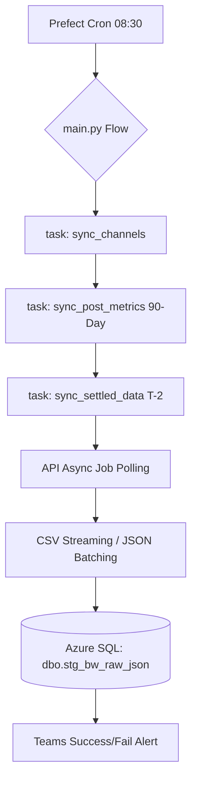

# 📊 Brandwatch Social Performance Extraction (Prefect 3.0)

**Host:** `dew-insights01`  
**Status:** 🟢 Active (Scheduled 8:30 AM Daily)  
**Orchestration:** Prefect 3.0  

---

## 1. Project Overview

This service is a high-performance ELT pipeline designed to extract social performance data from the Brandwatch (Falcon.io) API. It enforces an enterprise-grade **stateless container architecture**, moving data directly from the API to Azure SQL with zero local disk dependency.

---

## 2. Key Architectural Pillars

### 🧊 Stateless Container Design
This pipeline is strictly **pure API-to-Database**. There is no Docker volume mapping for data storage. 
- **In-Memory Streaming:** Engage comments are requested as exports and **streamed** (via `requests.get(stream=True)`) to avoid RAM exhaustion and local disk usage. Data is processed via a line-generator and inserted in batches of **500 rows**.
- **Direct Commits:** Data is committed to SQL as it is processed, ensuring the container can be destroyed and recreated on any host without data loss.

### 🎯 Granular Prefect Task Routing
The logic is decomposed into distinct Prefect `@tasks` to ensure high resilience and efficient retries.
- **Task-Level Retries:** If a transient API or SQL error occurs, Prefect retries **only that specific task** (e.g., `stage_data` has 3 retries), preventing full pipeline restarts.
- **Isolated Failure:** A failure in `sync_settled_data` will not trigger a re-run of the expensive 90-day `sync_post_metrics` sweep.
- **Concurrency Control:** Configured with `limit=1` to prevent overlapping runs and API rate-limit collisions.

---

## 3. Architecture & Logical Flow

### 🔄 Data Journey
1.  **Trigger**: Prefect Cron initiates the flow at **8:30 AM** daily.
2.  **Discovery**: `sync_channels` fetches active channel UUIDs.
3.  **Metadata Acquisition**: `sync_post_metrics` performs a 90-day sweep of `/publish/items` to capture evolving engagement metrics.
4.  **Async Polling**: The `BrandwatchClient` initiates asynchronous Insight requests and polls until `READY`.
5.  **Streaming Ingestion**: Large CSV payloads are parsed as a line-generator and inserted in batches of **500 rows**.
6.  **Landing**: All data is committed to the unified staging table `dbo.stg_bw_raw_json`.

### 🏗️ Workflow Diagram


---

## 4. Observability & Alerting

Integrated with **Microsoft Teams** via Adaptive Cards. The system features proactive monitoring for:
- **SQL Failures**: Connection timeouts (ODBC 18) and insertion errors.
- **API Exhaustion**: Automatic rotation of multiple API keys stored in `.env`.
- **Zombie Run Protection**: A strict **30-minute timeout** on all async polling loops.
- **Async Failures**: Detects and alerts on `FAILED` status within the Brandwatch internal job queue.
- **Flow Summary**: A "Data Engineer's Dream" alert is sent upon successful completion, detailing synced channels and target dates.

---

## 5. Operations

### Build & Deploy
```bash
docker-compose up -d --build brandwatch-extraction
```

### Monitoring Logs
```bash
docker-compose logs -f brandwatch-extraction
```
