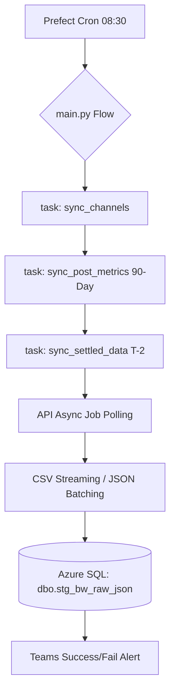

# 📊 Brandwatch Social Performance Extraction (Prefect 3.0)

**Host:** `dew-insights01`  
**Status:** 🟢 Active (Scheduled 8:30 AM Daily)  
**Orchestration:** Prefect 3.0  

> **System Map Reference:** For global server settings, Docker Compose service management, and Python environment details, refer to the **Master README** at `/opt/prefect/prod/code/readme.md`.

---

## 1. Project Overview

This service is a high-performance, **KISS-compliant** ELT pipeline designed to extract social performance data (Posts, Channels, and Engage Comments) from the Brandwatch (Falcon.io) API. It enforces an enterprise-grade stateless architecture, moving data directly from the API to Azure SQL with zero local disk dependency.

---

## 2. Architecture & Logical Flow

The pipeline follows a strictly ordered data journey to ensure all dependencies (like Channel UUIDs) are resolved before deep metric extraction begins.

### 🔄 Data Journey
1.  **Trigger**: Prefect Cron initiates the flow at **8:30 AM** daily.
2.  **Discovery**: `sync_channels` fetches active channel UUIDs to use as filters for downstream tasks.
3.  **Metadata Acquisition**: `sync_post_metrics` performs a 90-day sweep of `/publish/items` to capture new posts and updates to existing ones.
4.  **Async Polling**: The `BrandwatchClient` initiates asynchronous Insight requests. It polls the Brandwatch backend (up to 30 minutes) until data is `READY`.
5.  **Memory-Safe Ingestion**: 
    *   **JSON**: Large payloads are handled as Python dictionaries and dumped directly to SQL.
    *   **CSV**: Engage comments are requested as exports and **streamed** (chunk-by-chunk) to avoid RAM exhaustion.
6.  **Landing**: All data is committed to the unified staging table `dbo.stg_bw_raw_json`.

### 🏗️ Workflow Diagram


---

## 3. Key Architectural Pillars

### 🧊 Stateless Design
This pipeline is strictly **pure API-to-Database**. There is no Docker volume mapping for data storage. All data exists only in-memory during transit (streaming) before being committed to SQL. This ensures the container can be destroyed and recreated on any host without data loss.

### 🎯 Granular Failability
The logic is decomposed into distinct Prefect `@tasks`. If a transient API error occurs during the `sync_post_metrics` task, Prefect will retry **only that task** (up to 2 times), preventing a full restart of the 90-day sweep and saving API quota.
- **`sync_channels`**: 2 Retries
- **`sync_post_metrics`**: 2 Retries
- **`sync_settled_data`**: 2 Retries
- **`stage_data`**: 3 Retries (Handles SQL connection blips)

### 🛡️ Observability & Alerting
Integrated with **Microsoft Teams** via Adaptive Cards. The system features proactive monitoring for:
- **SQL Failures**: Connection timeouts (ODBC 18) and insertion errors.
- **API Exhaustion**: Automatic rotation of multiple API keys; alerts after 5 failed retries.
- **Zombie Run Protection**: A strict **30-minute timeout** (90 polls x 20s) on all async polling loops to prevent hung processes from consuming resources.
- **Async Failures**: Detects and alerts on `FAILED` status within the Brandwatch internal job queue.

### ⚡ Concurrency & Memory
- **Strict Concurrency**: Configured with `limit=1` to prevent overlapping runs and API rate-limit collisions.
- **Streaming Implementation**: Uses `requests.get(stream=True)` for Engage Exports. Data is decoded and parsed as a line-generator, then inserted in batches of **500 rows**, maintaining a near-zero memory footprint even for large CSV exports.

---

## 4. Data Contract (Azure SQL)

The system enforces a strict "Raw-to-Staging" contract. No transformation occurs in Python; the goal is 100% fidelity to the source API.

- **Target Table**: `dbo.stg_bw_raw_json`
- **Columns**:
    - `SourceEndpoint`: The origin tag (e.g., `POST_METRICS`, `CH_METRICS`, `ENGAGE_EXPORTS`).
    - `RawData`: The raw JSON or CSV-row-batch payload (NVARCHAR(MAX)).

---

## 5. Operations

### Build & Deploy
```bash
docker-compose up -d --build brandwatch-extraction
```

### Monitoring Logs
```bash
docker-compose logs -f brandwatch-extraction
```

---

## ✅ Technical Specs & Retries
- **API Retries**: 5 attempts with multi-key rotation.
- **Database Retries**: 3 attempts for connection timeouts.
- **Polling Timeout**: 30-minute hard-cap on backend job processing.
- **API Keys**: Dynamically loaded from `BRANDWATCH_API_KEY*` environment variables.
