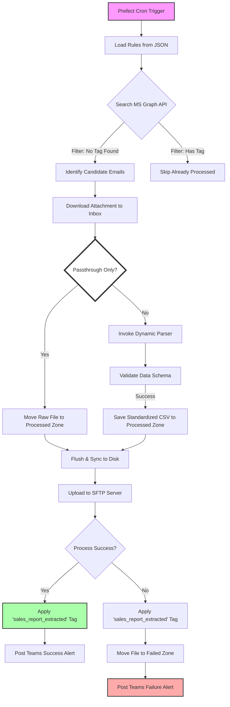

# 🗺️ High-Level System Architecture

This diagram illustrates the end-to-end data flow of the **Sales Report Extraction** pipeline, highlighting the recent transition to server-side state management and the new passthrough feature.

## Key Architectural Highlights

- **Prefect Orchestration:** Manages the overall lifecycle, retries, and monitoring.
- **Server-Side Idempotency:** The Microsoft Graph API acts as the state store via the `"sales_report_extracted"` category tag, ensuring each email is only processed once.
- **Dynamic Routing:** Supports both complex parsing (Standard Path) and simple file delivery (Passthrough Path) within the same engine.
- **Data Integrity:** Employs explicit OS-level flushing (`os.fsync`) before SFTP delivery to ensure zero-byte errors are avoided.
- **Observability:** Provides detailed validation artifacts and real-time Teams alerts for both successful and failed extractions.
