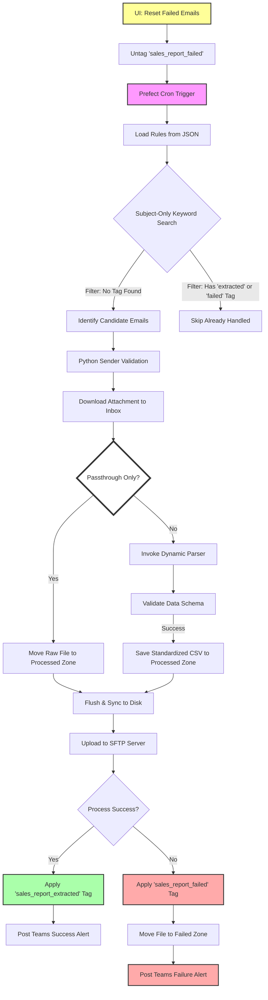

# 🗺️ High-Level System Architecture

This diagram illustrates the end-to-end data flow of the **Sales Report Extraction** pipeline, highlighting the recent transition to server-side state management, the new failure tagging, and the retry/reset mechanism.

## Key Architectural Highlights

- **Prefect Orchestration:** Manages the overall lifecycle, retries, and monitoring. Supports UI parameters (`days_back`, `target_rule_name`, `retry_failed`, `disable_notifications`) for historical backfills and bulk corrections.
- **Server-Side Idempotency:** The Microsoft Graph API acts as the state store via the `"sales_report_extracted"` and `"sales_report_failed"` category tags, ensuring each email is only processed once unless reset.
- **Dynamic Routing:** Supports both complex parsing (Standard Path) and simple file delivery (Passthrough Path) within the same engine.
- **Robust Search:** Employs a simplified, subject-only keyword search to bypass KQL query limitations, with sender validation handled purely in Python.
- **Stateless Operation:** Uses a 30-day dynamic rolling window instead of local persistence, ensuring high resilience to local storage failure.
- **Data Integrity:** Employs explicit OS-level flushing (`os.fsync`) before SFTP delivery to ensure zero-byte errors are avoided.
- **Observability:** Provides detailed validation artifacts and real-time Teams alerts for both successful and failed extractions, with a toggle to silence notifications during maintenance.
- **Bulk Retry Mechanism:** Explicit task (`reset_failed_emails`) to untag failed reports based on a time-window, enabling automated reprocessing of quarantine items.
