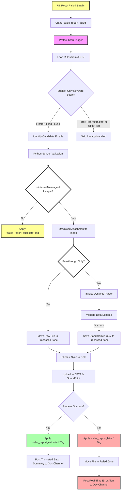

# 🗺️ High-Level System Architecture

This diagram illustrates the end-to-end data flow of the **Sales Report Extraction** pipeline, highlighting the recent transition to server-side state management, the new failure tagging, and the retry/reset mechanism.

## Key Architectural Highlights

- **Dual-Channel Orchestration:** Alerts are routed based on target audience. **Operations** receive high-level, truncated batch summaries (Ops Channel), while **Developers** receive granular technical error details (Dev Channel).
- **Multi-Layer Idempotency:** The system uses both Microsoft Graph categories and `internetMessageId` fingerprinting. Duplicates are tagged as `"sales_report_duplicate"` and skipped, preventing redundant processing.
- **Server-Side State Management:** The Graph API acts as the state store via `"sales_report_extracted"`, `"sales_report_failed"`, and `"sales_report_duplicate"` tags.
- **Universal Logging:** The `get_universal_logger` utility ensures seamless logging whether the script is running in production (Prefect) or locally (Standard Python), facilitating safer development and testing.
- **Centralized Alerting:** Notifications have been removed from low-level utilities (SFTP, SharePoint) and moved to the orchestrator. Exceptions now bubble up, ensuring consistent reporting and fewer "noisy" partial failures.
- **Truncated Batch Reporting:** To keep communication channels clean, successful batch summaries are truncated (e.g., showing the first 10 items) with links to full records on SharePoint.
- **Dynamic Routing:** Supports both complex parsing (Standard Path) and simple file delivery (Passthrough Path) within the same engine.
- **Stateless Operation:** Uses a 30-day dynamic rolling window instead of local persistence, ensuring high resilience to local storage failure.
- **Data Integrity:** Employs explicit OS-level flushing (`os.fsync`) before SFTP delivery to ensure zero-byte errors are avoided.
- **Bulk Retry Mechanism:** Explicit task (`reset_failed_emails`) to untag failed reports based on a time-window, enabling automated reprocessing of quarantine items.
